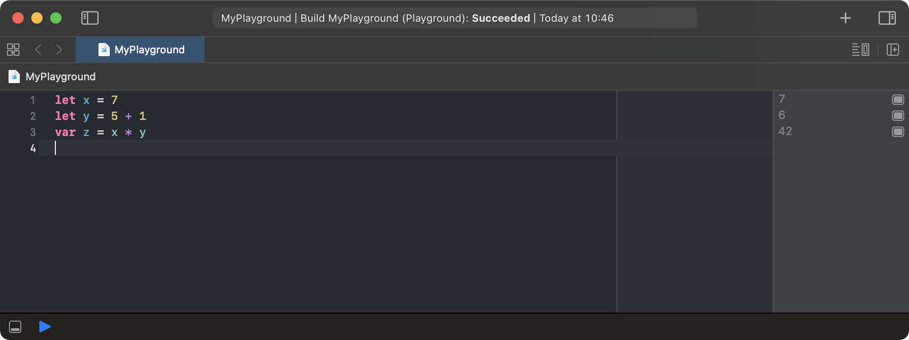

# Introduction

The basic mental model of a computer program describes a black box producing output based on the input provided it. A set of requirements describe the form of input, output and the transformation from one to the other. [@CITE SOME SOURCE ABOUT PROGRAM MENTAL MODEL]. Such a mental model proves to be inaccurate once program output diverging from the constraints specified in the requirements is observed: A calculated value is negative instead of positive or a preemptive program exit caused by an unexpected error is often the beginning of a debugging session: A software engineer attempts to align their mental model of the program with its actual runtime behavior. The engineer repeatedly iterates three steps hereby: (i) Gather context to formulate and refine a hypothesis on the underlying problem, (ii) instrument the program in order to prove their hypothesis, and (iii) test the augmented program to see if the hypothesis is correct. [@CITE DEBUGGING PROCESS]

Software engineers had a limited set of tools available to reconstruct and analyze a programs execution behavior before the raise of specilized debugger utilities. Beside memory dumps and alike, print statements are known to engineers up until today: Manually added, the provide concise insight on (i) the runtime control flow of a program ("Transparency of Semantics" [@Tanimoto_2015]) as well as the (ii) internal program state ("Transparency of Data" [@Tanimoto_2015]) when executed. This invasive method is time consuming [@CITE!] and requires clean up afterwards [@Alabor_Stolze_2020]. Modern debuggers for imperative programming environments make print statements obsolete: Step controls and stack frame inspection/manipulation allow software engineers to interact with program source code at runtime without actually modifying it; at least not for the sole reason of debug instrumentation.

Various previous work [@Salvaneschi_Mezini_2016] [@Banken_Meijer_Gousios_2018] [@CITE LIVE TUNING SALVANESCHI] showed that the paradigm of reactive programming (RP) bears its own challenges at debugging time: Imperative debugger tools are not aware of RP runtime semantics, thus their step controls cannot operate on the declarative data-flow graph nor can stack frame inspection replicate the correct context on interruption on a breakpoint [@Alabor_Stolze_2020]. As for others, this holds true for RxJS^[https://rxjs.dev], an RP runtime for JavaScript (e.g. used in Angular [@Angular_RxJS]) as well. We could show in an earlier study that software engineers using RxJS mostly fall back to the practice of adding manual print statements, once in need of a debugger tool [@Alabor_Stolze_2020].

```{caption="A basic data flow of five integers implemented with RxJS and TypeScript. Line 6 and 8 examplify print statements for debugging reasons." .Typescript}
import { of } from 'rxjs';
import { filter, map, tap } from 'rxjs/operators';

of(0, 1, 2, 3, 4).pipe( // Flow of integers 0..4
  filter(i => i < 4),   // Omit 4
  tap(console.log),     // Print statement
  map(i => i * 2),      // Multiply with 2
  tap(console.log)      // Print statement
).subscribe()
```

In this paper, we present a reactive debugging solution for RxJS, integrated with Microsoft Visual Studio Code^[https://code.visualstudio.com]. We will explore the influences of live programming (LP) and other predecessor work in Section [2](#sec:related_work) and show how a usability test study led to the first release of the debugging extension in Section [3](#sec:study) and [4](#sec:implementation). Before we come to our conclusion in Section [6](#sec:conclusion), we summarize possible future work in Section [5](#sec:future_work).


# Related Work {#sec:related_work}

## Debugging and Live Programming

Tanimoto describes LP in his "Fundamental Notion of Liveness"[@Tanimoto_2013] as a descendant of debugging: Engineers go through the "edit, compile, link and run" cycle over and over again to analyze how their changes might influence the program they debug. This time-consuming loop is hidden-away in a LP environment: Once the software engineer updates the programs source code, the changes are propagated, optimally, immediately, and the program is reexecuted.

Contemporary IDEs provide sophisticated debuggers for imperative-style programming languages. All of them boil down to consist of the following two essential components[@CITE TRADITIONAL DEBUGGER] though: (i) Execution controls can pause a program at any given point and allow to step through code statements manually. While doing so, a (ii) value inspector tracks the values assigned to variables of currently active stack frames. Tanimoto calls this semantic and data transparency in his paper [@Tanimoto_2013]: The control flow as well as the data processed by a program is "transparent" to the engineer.

A LP environment continuously (re-)executes a program. Hence, interrupting this execution flow would be counter intuitive [@CITE??]. Instead, LP environments can make use of probes and traces, as suggested  by McDirmid [@McDirmid_2013]. Figure [1](#fig:swift-playground) shows a minimalistic Swift program running in Apples Swift Playgrounds^[https://developer.apple.com/swift-playgrounds/] LP environment.

{#fig:swift-playgrounds}

## Reactive Debugging


- Types of debuggers (imperative, reactive [@Salvaneschi_Mezini_2016], omniscient [@Pothier_Tanter_2009] [@OCallahan_Jones_Froyd_Huey_Noll_Partush_2017])
- Affordances in live programming environments [@Tanimoto_2013]
- Scala Worksheets, Swift Playground, Wallaby.js
- RxJS
	- Software engineers working in the field of web frontend applications RxJS^[https://rxjs.dev] is a prominent library to implement TypeScript/JavaScript-based applications using RP used by Angular [@Angular_RxJS] and others. 
- Reactive Inspector [@Salvaneschi_Mezini_2016_Inspector] for REScala (Visualization! <3)
	-  Salvaneschi et al. [@Salvaneschi_Mezini_2016_Inspector] showed with *Reactive Inspector* an implementation of a reactive debugger for REScala^[https://www.rescala-lang.com]. This tool solves the RP-specific these challenges for this particular RP runtime environment.
- *Optional: RxFiddle [@Banken_Meijer_Gousios_2018]*
- *Optional: rxjs-playground https://github.com/hediet/rxjs-playground*

# Research {#sec:research}

- Previous Work [@Alabor_Stolze_2020]
  - Interviews
  - Observational Study
- New work:
	- Prototype
	- UX Testing of Prototype [@Alabor_2020]
	- The Result: An extension for Visual Studio Code, as described in the next section:

# Implementation {#sec:implementation}

- Demonstrate/describe Extension
  - Log Points -> Relate with probes/traces [@McDirmid_2013]
- Categorize Extension in terms of "Levels of Live" [@Tanimoto_2013]
- *Idea: Can we demonstrate somehow an example with hot code reloading, so we have a better "live" experience?*

# Future Work {#sec:future_work}

- Features:
	- Support for Browser-based Applications (Selling point: Angular)
	- Visualization of data flows
	- Omniscient/time travel debugging for data flows
- Research:
	- Verify if extension helps beginners to get started with RxJS
	- Verify effectiveness of extension for professionals (re-execute previous observational study)
  - More Usability Testing

# Conclusion {#sec:conclusion}

- Wrap things up

